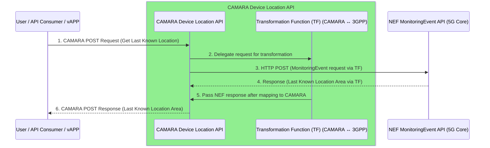

# CamaraLocationRetrieval
Camara Location Retrieval is a service that exposes Device Location API capabilities through standardized CAMARA APIs.   
This project bridges device location data with CAMARA Location API for seamless integration and consumption by vertical edge applications.

## Features

- **Camara LocationRetrieval API:** This service provides an endpoint that renders the location of a UE connected to 5G Core as a polygon shape resolution.  
- **Flexible Deployment:** Supports deployment via Docker Compose.
- **Map Rendering:** Creates a HTML file illustrating the polygon's schema location to a map.

## Getting Started
### Prerequisites
Docker and Docker compose

### Clone the Repo
```
git clone https://github.com/FRONT-research-group/CamaraLocationRetrieval.git
cd CamaraLocationRetrieval
```

## Deployment
### Docker Compose
1. Build and start service:
   `docker compose up --build`
2. The service will be available at `http://localhost:8080`
3. For *HTML Page*: `docker cp` the HTML file into your local host.

## API Documentation
The **Camara Location Retrieval API** is documented in the [openAPI spec](https://github.com/FRONT-research-group/CamaraLocationRetrieval/blob/main/location_retrieval_openapi.yaml).\
Supported Error Types: 400 BAD REQUEST, 404 DEVICE IDENTIFIER NOT FOUND

## Configuration
Environment variables can be set in `.env` for Docker Compose.\
Also a `setup.sh` script is provided to create a `.env` file.

## Contribution
Contributions are welcome! Please open issues or submit pull requests for improvements.

## License
This project is licensed under the [Apache License 2.0](https://github.com/FRONT-research-group/CamaraLocationRetrieval/blob/main/LICENSE).

## Contact
For questions or support, contact: p.pavlidis@iit.demokritos.gr

---

# Sequence Diagram


