# CAMARA Device Location – Location Retrieval API (v0.5 Implementation)

This repository contains an implementation of the **CAMARA Device Location – Location Retrieval API**, compliant with **version 0.5** of the CAMARA specification.  
The API provides an abstraction layer that allows an end user (or service) to request and retrieve polygon shaped device location information area from any **3GPP-compliant 5G network**, without needing to handle the details of the underlying network communication.  

---

## 📘 Overview

The CAMARA API acts as an intermediary between application clients and the **3GPP Network Exposure Function (NEF)** through the **CAPIF framework**, ensuring secure and standardized access to device location information.

### 🔁 API Flow Summary

1. A client sends an **HTTP POST** request to the endpoint ``/location-retrieval/v0.5/retrieve`` with:
   - **Request Body:** containing a `phoneNumber` in the form `+30XXXXXXXXXX`
   - **Header:** `x-correlator` (mandatory for request correlation)

2. The CAMARA API:
   - Validates the presence of the `x-correlator` header  
   - Validates the `phoneNumber` parameter  
   - Passes the validated data to the **Transformation Function (TF)**

3. The **Transformation Function (TF)** maps CAMARA data types to **3GPP MonitoringEvent API** data types required for NEF communication:
   - `phoneNumber` → `msisdn`
   - Uses **LAST_KNOWN_LOCATION** feature to query NEF

4. The **NEF** responds with location data (or failure response).

5. The **TF** maps 3GPP response data back into **CAMARA-compatible** data types and returns it to the requesting client.

---

## ⚙️ Architecture Components

| Component | Description |
|------------|--------------|
| **CAMARA API** | Exposes `/location-retrieval/v0.5/retrieve` endpoint. Handles request validation and response formatting. |
| **Transformation Function (TF)** | Maps CAMARA payloads to 3GPP NEF API format and vice versa. |
| **CAPIF Framework** | Provides authentication, authorization, and secure exposure of the 3GPP APIs. |
| **NEF (Network Exposure Function)** | The 3GPP API endpoint that retrieves device location information based on `LAST_KNOWN_LOCATION` feature. |

---

## Getting Started

### Clone the Repo
```
git clone https://github.com/FRONT-research-group/CamaraLocationRetrieval.git
cd CamaraLocationRetrieval
```

## 🧩 Prerequisites

Before running the service, ensure the following:

1. **Python Environment**
   Create and activate a virtual environment:
   ```bash
   python3 -m venv .venv
   source .venv/bin/activate
   ```
2. **Install Requirements**
   ```bash
   pip install -r requirements.txt
   ```
3. **CAPIF User Setup**  
   A CAPIF user must be created before deploying any services and a CAPIF deployment should have been deployed.  
   For convenience a capif user creation script is provided for registration of a CAPIF USER in a **deployed** CAPIF environment, as well as its configuration json file ``capif_sdk_register.json``.
   
   ```bash
   cd user_creation/
   python register_and_login.py
   ```
4. **Docker and make installations**
   
## 🚀 Deployment

Deployment and cleanup are managed through the Makefile.

### Configure .env file

| ENV VAR | Description |
|------------|--------------|
| **HOST** | The host that will be used in the python application. |
| **PORT** | The port that will be used in the python application |
| **BASE_URL** | The api root that will be used for communication with the 5GC. Default ``http://172.17.0.1:8000``. |
| **SCS_AS_ID** | The AF_ID that is used to retrieve UE Devices in the 5G Core. |
| **INVOKER_CONFIG_FILE** | The file that will be used for onboarding the invoker to CAPIF. Default ``./app/invoker_onboarding/invoker_config_sample.json``  |

### Deploy Services
```bash
make deploy
```
This command will:
 - Load configuration from the .env file
 - Build and start Docker containers

### Remove Services
```bash
make clean
```
This command will:
 - Stop and remove all related Docker containers.

## 📄 Example Request

```bash
curl -X POST https://<api-host>/location-retrieval/v0.5/retrieve 
  -H "Content-Type: application/json" 
  -H "x-correlator: 12345" 
  -d '{
         "device": {
           "phoneNumber": "+3069XXXXXXXX" 
         }
      }'
```

## API Documentation
The **Camara Location Retrieval API** is documented in the [openAPI spec](https://github.com/FRONT-research-group/CamaraLocationRetrieval/blob/main/location_retrieval_openapi.yaml).\
Supported Error Types: 400 BAD REQUEST, 404 DEVICE IDENTIFIER NOT FOUND

---

# Sequence Diagram

```mermaid
%%{config: { 'fontSize': '150px' }}%%
sequenceDiagram
   participant User as User / API Consumer / vAPP
   box lightgreen CAMARA Device Location API
      participant CAMARA as CAMARA Device Location API
      participant Transform as Transformation Function (TF) (CAMARA ↔ 3GPP)
   end
   participant NEF as NEF MonitoringEvent API (5G Core)
   
   User->>CAMARA: 1. CAMARA POST Request (Get Last Known Location)
   CAMARA->>Transform: 2. Delegate request for transformation
   CAMARA->>NEF: 3. HTTP POST (MonitoringEvent request via TF)
   NEF-->>CAMARA: 4. Response (Last Known Location Area via TF)
   Transform->>CAMARA: 5. Pass NEF response after mapping to CAMARA
   CAMARA-->>User: 6. CAMARA POST Response (Last Known Location Area)
```


## Contribution
Contributions are welcome! Please open issues or submit pull requests for improvements.

## License
This project is licensed under the [Apache License 2.0](https://github.com/FRONT-research-group/CamaraLocationRetrieval/blob/main/LICENSE).

## Contact
For questions or support, contact: p.pavlidis@iit.demokritos.gr
